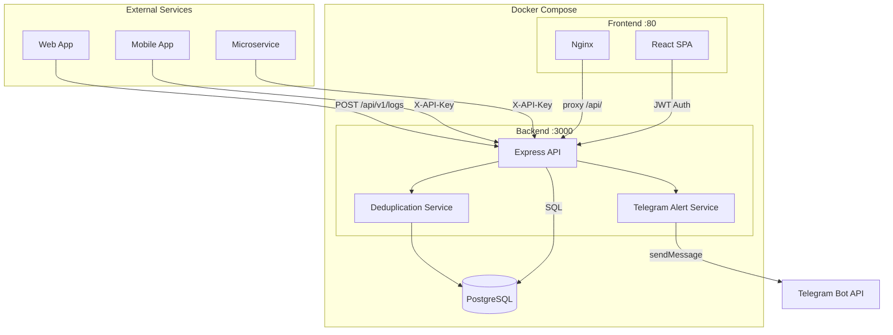
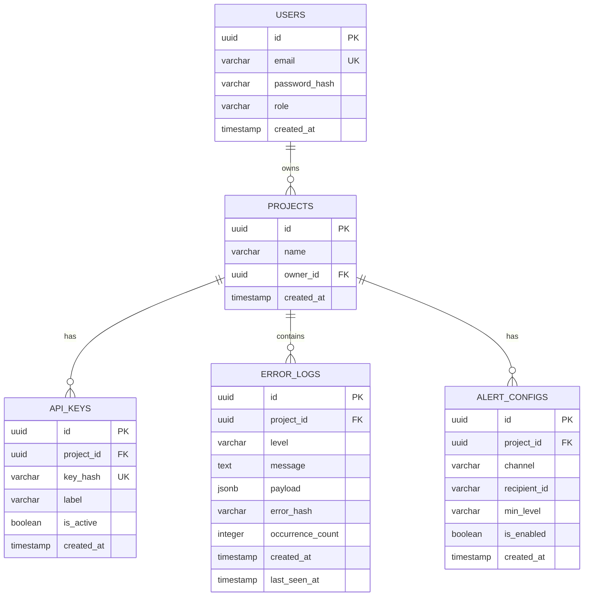

# 🛡️ NodeWatch

**Centralized Error Monitoring & Analytics Platform**

NodeWatch is an automated system for collecting, storing (PostgreSQL), and visualizing (React) software error data. Built with Node.js (Express), PostgreSQL, and React — deployed via Docker Compose.

---

## 📋 Features

- **Push-based Log Collection** — external services send errors via REST API using API keys
- **Smart Deduplication** — identical errors are merged; `occurrence_count` increments automatically
- **Real-time Dashboard** — error frequency charts, summary statistics, incidents table
- **Detailed Incident View** — stack traces, JSON payload, context for each error
- **Telegram Alerts** — instant notifications via Telegram Bot when new errors occur
- **Role-Based Access Control (RBAC)** — three roles: Admin, Developer, Guest
- **Admin Panel** — manage projects, API keys, users, alert configs, and data retention
- **User Management** — admin can create, edit, and delete user accounts
- **Profile Self-Service** — every user can change their own login/email and password
- **Responsive UI** — adaptive interface for desktop and mobile devices
- **Docker Ready** — one-command deployment with `docker-compose up`

---

## 🏗️ Architecture



---

## 🚀 Quick Start

### Prerequisites

- [Docker](https://www.docker.com/) & Docker Compose
- [Node.js 20+](https://nodejs.org/) (for local development only)

### Deploy with Docker

```bash
# 1. Clone the repository
git clone <repository-url>
cd NodeWatch

# 2. Create environment file
cp .env.example .env
# Edit .env — set TELEGRAM_BOT_TOKEN and JWT_SECRET

# 3. Start all services
docker-compose up -d --build

# 4. Verify
curl http://localhost:3000/health
```

After startup:
- **Frontend (Dashboard):** http://localhost:5173
- **Backend API:** http://localhost:3000
- **Health Check:** http://localhost:3000/health

### Local Development

```bash
# 1. Start the database
docker-compose up -d db

# 2. Backend (terminal 1)
cd backend
npm install
npm run dev

# 3. Frontend (terminal 2)
cd frontend
npm install
npm run dev
```

> The frontend dev server uses `VITE_API_URL` from `frontend/.env` to connect to the backend.

---

## 🔑 Default Credentials

| Role | Login / Email | Password |
|------|---------------|----------|
| Admin | `admin@nodewatch.local` | `admin123` |

> ⚠️ **Change the admin password and `JWT_SECRET` before deploying to production!**

---

## 📡 API Reference

### Log Collection (API Key Auth)

| Method | Path | Description | Auth |
|--------|------|-------------|------|
| `POST` | `/api/v1/logs` | Submit an error log | API Key |
| `POST` | `/api/v1/logs/test` | Generate a test error event | JWT |

**Example — sending an error:**
```bash
curl -X POST http://localhost:3000/api/v1/logs \
  -H "Content-Type: application/json" \
  -H "X-API-Key: <your-api-key>" \
  -d '{
    "level": "error",
    "message": "Cannot read properties of undefined",
    "payload": {
      "stack": "TypeError: Cannot read properties...",
      "file": "app.js",
      "line": 42,
      "env": "production"
    }
  }'
```

**Supported log levels:** `info`, `warn`, `error`, `critical`

### Authentication (JWT)

| Method | Path | Description | Auth |
|--------|------|-------------|------|
| `POST` | `/api/v1/auth/login` | Sign in | — |
| `POST` | `/api/v1/auth/register` | Create user (admin only) | JWT + Admin |
| `GET` | `/api/v1/auth/me` | Get current user info | JWT |
| `PATCH` | `/api/v1/auth/profile` | Update own email/password | JWT |

### Dashboard (JWT)

| Method | Path | Description |
|--------|------|-------------|
| `GET` | `/api/v1/dashboard/projects` | List all projects |
| `GET` | `/api/v1/dashboard/stats?project_id=...` | Project statistics |
| `GET` | `/api/v1/dashboard/logs?project_id=...` | Paginated error logs (sort, search) |
| `GET` | `/api/v1/dashboard/logs/:id` | Single error details |

**Query parameters for `/dashboard/logs`:**
| Param | Description | Example |
|-------|-------------|---------|
| `project_id` | Filter by project (required) | `uuid` |
| `page` | Page number (default: 1) | `2` |
| `limit` | Items per page (default: 20) | `50` |
| `level` | Filter by level | `error` |
| `search` | Search in message text (ILIKE) | `TypeError` |
| `sort_by` | Sort column | `last_seen_at`, `level`, `occurrence_count` |
| `sort_order` | Sort direction | `asc`, `desc` |

### Administration (JWT + Role)

| Method | Path | Description | Min. Role |
|--------|------|-------------|-----------|
| `POST` | `/api/v1/admin/projects` | Create project | Developer |
| `DELETE` | `/api/v1/admin/projects/:id` | Delete project + all data | Developer |
| `GET` | `/api/v1/admin/projects/:id/keys` | List API keys | Developer |
| `POST` | `/api/v1/admin/projects/:id/keys` | Generate API key | Developer |
| `DELETE` | `/api/v1/admin/keys/:id` | Revoke (deactivate) key | Developer |
| `GET` | `/api/v1/admin/projects/:id/alerts` | List alert configs | Developer |
| `POST` | `/api/v1/admin/projects/:id/alerts` | Add Telegram alert | Developer |
| `DELETE` | `/api/v1/admin/alerts/:id` | Remove alert config | Developer |
| `GET` | `/api/v1/admin/users` | List all users | Admin |
| `PATCH` | `/api/v1/admin/users/:id` | Edit user (role/email/password) | Admin |
| `DELETE` | `/api/v1/admin/users/:id` | Delete user | Admin |
| `DELETE` | `/api/v1/admin/logs/cleanup` | Purge logs older than N days | Admin |

---

## 🔐 Role-Based Access Control (RBAC)

| Feature | Admin | Developer | Guest |
|---------|:-----:|:---------:|:-----:|
| View dashboard & statistics | ✅ | ✅ | ✅ |
| View incident list | ✅ | ✅ | ✅ |
| View stack traces / payload | ✅ | ✅ | ❌ |
| Edit own profile (login/password) | ✅ | ✅ | ✅ |
| Create projects | ✅ | ✅ | ❌ |
| Manage API keys | ✅ | ✅ | ❌ |
| Configure Telegram alerts | ✅ | ✅ | ❌ |
| Manage users (create/edit/delete) | ✅ | ❌ | ❌ |
| Purge old data (retention) | ✅ | ❌ | ❌ |

---

## 🗄️ Database Schema



---

## 🔒 Security

- **API Key Hashing** — raw API keys are never stored; only SHA-256 hashes are persisted
- **Password Hashing** — bcrypt with 10 salt rounds
- **JWT Authentication** — configurable expiration (`JWT_EXPIRES_IN`), signed with `JWT_SECRET`
- **RBAC Middleware** — `requireAdmin` and `requireDeveloper` middleware enforce role restrictions
- **Profile Changes** — require current password verification (self-service)
- **Admin Overrides** — admins can reset credentials without knowing current passwords

---

## ⚙️ Environment Variables

| Variable | Default | Description |
|----------|---------|-------------|
| `DB_HOST` | `db` | PostgreSQL host (`db` for Docker, `localhost` for local) |
| `DB_PORT` | `5432` | PostgreSQL port |
| `DB_USER` | `nodewatch` | Database username |
| `DB_PASSWORD` | `nodewatch_secret` | Database password |
| `DB_NAME` | `nodewatch_db` | Database name |
| `PORT` | `3000` | Backend server port |
| `NODE_ENV` | `development` | Environment mode |
| `JWT_SECRET` | *(change me)* | Secret key for JWT signing |
| `JWT_EXPIRES_IN` | `7d` | JWT token expiration |
| `TELEGRAM_BOT_TOKEN` | — | Telegram Bot API token from @BotFather |
| `VITE_API_URL` | `/api/v1` | Frontend API base URL (dev only) |

---

## 📁 Project Structure

```
NodeWatch/
├── docker-compose.yml          # Container orchestration
├── init.sql                    # DB initialization (tables + seed data)
├── .env.example                # Environment variable template
├── dummy-client.js             # Integration example (error simulator)
├── README.md
│
├── backend/
│   ├── Dockerfile
│   ├── package.json
│   └── src/
│       ├── server.js           # Express entry point + routing
│       ├── db.js               # PostgreSQL connection pool
│       ├── middleware/
│       │   ├── auth.js         # API Key + JWT + RBAC middleware
│       │   └── errorHandler.js # Global error handler
│       ├── controllers/
│       │   ├── logs.controller.js       # Error collection + test events
│       │   ├── auth.controller.js       # Login / Register / Profile
│       │   ├── dashboard.controller.js  # Stats / Logs / Projects
│       │   └── admin.controller.js      # CRUD: Projects, Keys, Alerts, Users
│       ├── services/
│       │   ├── deduplication.js         # MD5 hash + dedup window
│       │   └── alerts.js               # Telegram Bot API integration
│       └── routes/
│           ├── logs.routes.js
│           ├── auth.routes.js
│           ├── dashboard.routes.js
│           └── admin.routes.js
│
└── frontend/
    ├── Dockerfile              # Multi-stage build (Node → Nginx)
    ├── nginx.conf              # SPA routing + API proxy
    ├── package.json
    ├── vite.config.js
    └── src/
        ├── main.jsx
        ├── App.jsx
        ├── api/client.js       # Axios + JWT interceptors
        ├── context/AuthContext.jsx
        ├── pages/
        │   ├── Login.jsx           # Login page
        │   ├── Dashboard.jsx       # Stats, charts, incidents
        │   ├── Incidents.jsx       # Filterable incident list
        │   ├── IncidentDetails.jsx # Stack trace viewer (RBAC)
        │   └── Settings.jsx        # Admin panel (4 tabs)
        └── components/
            ├── Layout.jsx          # Responsive layout + mobile nav
            ├── Sidebar.jsx         # Collapsible sidebar + profile edit
            ├── ProfileModal.jsx    # Self-service credential editor
            ├── StatsCard.jsx       # Metric display card
            ├── ErrorsChart.jsx     # Area chart (Recharts)
            ├── IncidentsTable.jsx  # Sortable, paginated table
            └── TestEventButton.jsx # Test event generator
```

---

## 🛠 Tech Stack

| Layer | Technology |
|-------|-----------|
| Frontend | React 18, Vite, TailwindCSS, Recharts, Lucide Icons, Axios |
| Backend | Node.js, Express.js, JWT (jsonwebtoken), bcrypt |
| Database | PostgreSQL 16 |
| Alerts | Telegram Bot API (node-telegram-bot-api) |
| Deployment | Docker, Docker Compose, Nginx |

---

## 📄 License

This project is part of a diploma thesis.
